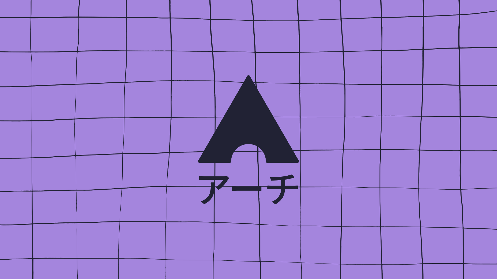

<div aling="center">


</div>

<!-- Useful trick to make a space between elements fast, 
it's not the best way to do it I'm sure. -->
###

<p align="center">
Public repository containing my wallpapers, feel free to copy anything you want as this is just a backup of them.
</p>


<!-- Create a line seperating stuff on github. -->
##

### 💨 Installation

> [!NOTE]
> This repository is included by default in
> my [dotfiles](https://github.com/efettf/dotfiles) under _~/wallpapers_.

```bash
$ git clone https://github.com/efettf/github.git
```

### 🏞️ Preview





<!-- Catppuccin banner at the bottom for the looks, 
make sure to remove it when changing theme as well as the colors in banners above. -->

